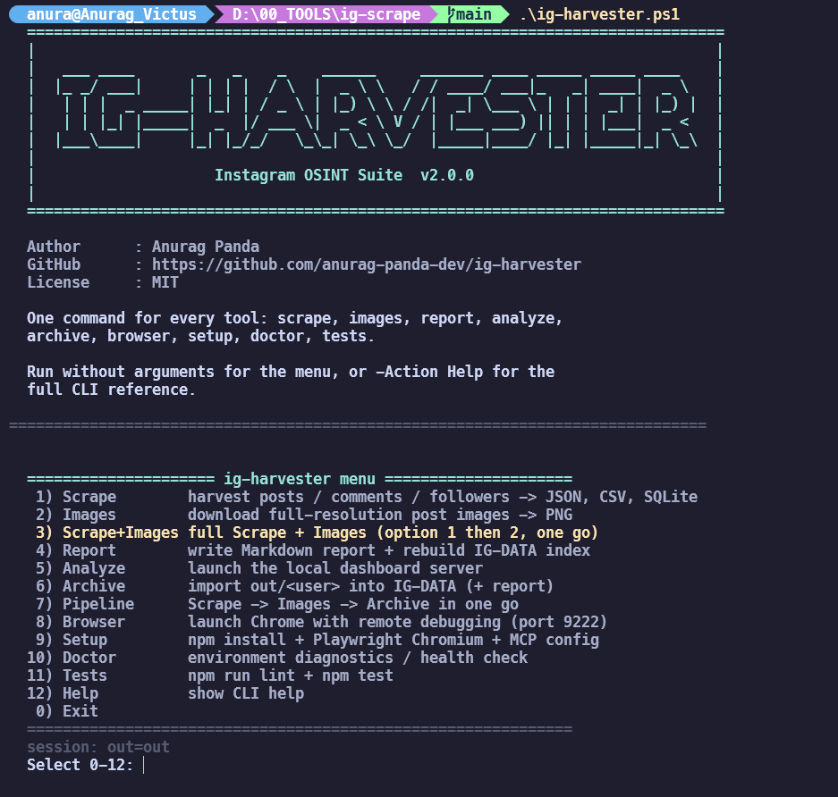

# ig-harvester

<p align="center">
  
  
  
  
</p>

<p align="center">
  <b>Instagram OSINT Collector</b><br>
  A production-ready Playwright-based Instagram scraper that drives your own logged-in Chrome via CDP.
</p>

<p align="center">
  
</p>

---

## Table of Contents

- [Features](#features)
- [Installation](#installation)
- [Quick Start](#quick-start)
- [Usage](#usage)
- [CLI Flags](#cli-flags)
- [Output](#output)
- [Analytics](#analytics)
- [ig-analyzer — Live Dashboard](#ig-analyzer--live-dashboard)
- [ig-images — Post Image Downloader](#ig-images--post-image-downloader)
- [ig-harvester.ps1 — Single Entry Point](#ig-harvesterps1--single-entry-point)
- [Archiving to IG-DATA](#archiving-to-ig-data)
- [Architecture](#architecture)
- [Docker](#docker)
- [Testing](#testing)
- [Contributing](#contributing)
- [License](#license)
- [Credits](#credits)
- [Disclaimer](#disclaimer)

---

## Features

| Feature | Description |
|---|---|
| **Triple-source extraction** | Embedded Relay JSON + semantic DOM + screenshots |
| **Carousel/sidecar posts** | Extracts all photos/videos in multi-media posts |
| **Image downloader** | `dependencies/ig-images.mjs` saves every post image (each carousel slide too) as timestamped real PNGs |
| **Comment threads** | Full reply threads with like counts |
| **Media URLs** | All image/video URLs (filters out profile pictures) |
| **Hashtags & mentions** | Extracted from captions |
| **Resume support** | SQLite cache by shortcode; interrupted runs pick up where they left off |
| **Proxy support** | HTTP/SOCKS5 proxies for operational security |
| **Multiple output formats** | JSON, CSV, and SQLite |
| **Analytics** | Engagement metrics, posting patterns, network stats, content analysis |
| **Archiving** | `dependencies/import-data.ps1` copies each run into `IG-DATA/<user>/` as a dated snapshot — tables, screenshots and post images — with static reports and a master index |
| **Structured logging** | Levels, JSON mode, child loggers |
| **Retry with backoff** | Exponential backoff on transient failures |
| **Docker support** | Containerized deployment |
| **Modular architecture** | Clean separation of concerns |
| **Unit tested** | Parser tests included |

---

## Installation

### Prerequisites

- [Node.js](https://nodejs.org/) >= 20
- [Chrome](https://www.google.com/chrome/) (system)
- A burner Instagram account

### One-click (Windows)

```powershell
.\dependencies\start.ps1 --profile someuser --comments --followers --following
```

### Manual

```bash
git clone https://github.com/anurag-panda-dev/ig-harvester.git
cd ig-harvester
npm install
```

---

## Quick Start

```bash
# 0. Or use the interactive menu: it asks for the target (default: anur.panda),
#    then lets you set posts / comments / followers / ... before running
.\ig-harvester.ps1

# 1. Launch Chrome with debugging (dedicated profile)
.\dependencies\launch-chrome-debug.ps1

# 2. Log into a BURNER Instagram account in that window

# 3. Scrape
node dependencies/scrape-ig.mjs --profile someuser --posts 50 --comments --followers --following --sqlite
```

---

## Usage

```powershell
# Basic
node dependencies/scrape-ig.mjs --profile someuser

# Full OSINT harvest
node dependencies/scrape-ig.mjs --profile someuser --posts 50 --comments --followers --following --sqlite

# With proxy
node dependencies/scrape-ig.mjs --profile someuser --proxy http://127.0.0.1:8080

# Config file - layering is defaults < config.json < command line
# (the command line only wins for flags you actually passed)
node dependencies/scrape-ig.mjs --config config.json

# Every post the profile grid serves (no 30-post cap)
node dependencies/scrape-ig.mjs --profile someuser --posts all

# Screenshots only
node dependencies/scrape-ig.mjs --profile someuser --shots-only

# Download every post image as <user>-<date>-<time>-<NN>.png (carousels included)
node dependencies/ig-images.mjs --profile someuser --posts 50

# Full Scrape + Images in one go (menu option 3)
.\ig-harvester.ps1 ScrapeImages someuser --posts 50 --comments

# Analyze scraped data (live dashboard)
node dependencies/ig-analyzer.mjs
node dependencies/ig-analyzer.mjs --user someuser --port 8080

# Docker
docker build -t ig-harvester .
docker run -v $(pwd)/out:/app/out ig-harvester --profile someuser --comments
```

---

## CLI Flags

| Flag | Default | Description |
|---|---|---|
| `--profile <name>` | – | Target username |
| `--url <url>` | – | Full Instagram URL |
| `--posts N\|all` | `30` | Max posts to scrape - `all` (or `0`) = every post the grid serves |
| `--comments` | off | Harvest post comments with threads |
| `--followers` | off | Harvest follower list (all) |
| `--following` | off | Harvest following list (all) |
| `--shots` | off | Capture screenshots |
| `--out DIR` | `out` | Output directory |
| `--cdp URL` | `http://127.0.0.1:9222` | Chrome CDP endpoint |
| `--headless` | off | Run headless |
| `--proxy URL` | – | HTTP/SOCKS proxy |
| `--config FILE` | – | JSON config file |
| `--sqlite` | off | Also write SQLite database |
| `--no-resume` | – | Disable resume cache |
| `--force` | off | `ig-images`: re-download files already on disk (redo a bad run) |
| `--delay-min N` | `900` | Min delay (ms) |
| `--delay-max N` | `2600` | Max delay (ms) |
| `--log-level` | `info` | `debug` / `info` / `warn` / `error` |
| `--json-log` | off | Structured JSON logging |

---

### Fewer posts than the profile claims?

Post links are read from the **profile grid**, so a run only returns what
Instagram serves to the session you are attached to:

| What you see | Why | What to do |
|---|---|---|
| exactly `30` posts, the header claims more | the default `--posts 30` cap | `--posts 500`, or `--posts all` for every post (`-Posts all` / `-AllPosts` in the harvester) |
| `12` / `24` / `36` posts | the grid stopped paginating (slow or gated layout) | re-run - the resume cache continues where it stopped - and read the `grid: N permalink(s) - <reason>` line, which names the exact stop reason |
| `0` posts plus `This account is private` | the logged-in session does not follow the target, or the follow is still pending (`Requested`) | attach Chrome logged in as the burner that already follows the account; a pending request serves nothing |
| `0` posts and no warning | the profile does not exist (or is blocked) | check the spelling and the account status |

Both entry points print `grid stopped early: N of M posts found` when the
profile header is higher than what the grid returned, and an explicit error
for the private wall, so a missing-post problem is always explained in the
log instead of showing up as a silent short list.

> **Private accounts**: a burner that already *follows* a private profile sees
> the same grid as any other follower. Only two things break that - the
> browser being logged into a different account, and the follow request not
> having been accepted yet. Always confirm consent before collecting data.
---

## Output

All files saved inside a folder named after the username:

```
out/
  someuser/
    someuser.json             # Full payload + analytics
    someuser-posts.csv        # One row per post
    someuser-comments.csv     # One row per comment
    someuser-followers.csv    # One row per follower
    someuser-following.csv    # One row per following
    someuser.db               # SQLite database (--sqlite)
    screenshots/*.png         # Screenshots (--shots)
    images/*.png              # Post images (dependencies/ig-images.mjs)
    .cache.db                 # Resume cache (internal)
```

---

## Analytics

The scraper computes OSINT metrics automatically:

```json
{
  "analytics": {
    "engagement": {
      "totalLikes": 1234,
      "totalComments": 56,
      "avgLikes": 45,
      "avgComments": 2,
      "engagementRate": "1.23%",
      "postsAnalyzed": 30
    },
    "posting": {
      "earliestPost": "2024-01-01T00:00:00.000Z",
      "latestPost": "2026-10-07T00:00:00.000Z",
      "daysActive": 1000,
      "postsPerDay": "0.03",
      "postsPerWeek": "0.21",
      "bestPostingHour": "18:00",
      "bestPostingDay": "Saturday"
    },
    "account": {
      "estimatedCreated": "2024-01-01T00:00:00.000Z",
      "estimatedAgeDays": 1000
    },
    "content": {
      "topHashtags": [{ "tag": "DevProfile", "count": 5 }],
      "topMentions": [{ "user": "friend1", "count": 3 }],
      "mostLiked": [{ "shortcode": "ABC123", "likes": 500, "url": "..." }],
      "mostCommented": [{ "shortcode": "DEF456", "comments": 50, "url": "..." }],
      "carouselPosts": 10,
      "reelPosts": 5,
      "photoPosts": 15
    },
    "network": {
      "followerCount": 299,
      "followingCount": 925,
      "followerFollowingRatio": "0.32",
      "verifiedFollowers": 2,
      "verifiedFollowing": 5
    },
    "bio": {
      "hasEmail": true,
      "email": "user@example.com",
      "hasPhone": false,
      "phone": null,
      "hasUrl": true,
      "url": "https://example.com",
      "length": 150
    }
  }
}
```

---

## ig-analyzer — Live Dashboard

After scraping, analyze the data with a live web dashboard:

```bash
# Auto-detect latest scraped user
node dependencies/ig-analyzer.mjs

# Specific user
node dependencies/ig-analyzer.mjs --user someuser

# Custom port
node dependencies/ig-analyzer.mjs --port 8080

# Custom data directory
node dependencies/ig-analyzer.mjs --dir out/someuser

# One-click (Windows)
.\dependencies\ig-analyzer.ps1
.\dependencies\ig-analyzer.ps1 --user someuser --port 8080
```

The dashboard opens at `http://localhost:8080` and includes:

| Section | What it shows |
|---|---|
| **Profile overview** | Bio, stats, verified/private badges |
| **Engagement metrics** | Rate, total/avg likes, comments |
| **Charts** | Likes per post, posts by hour, posts by day |
| **Content analysis** | Top hashtags, top mentions, most liked/commented |
| **Posting patterns** | Best time, frequency, account age |
| **Network stats** | Follower/following ratio, verified counts |
| **Bio analysis** | Email, phone, URL detection |

---

## ig-images — Post Image Downloader

A separate tool that does exactly one thing: save every post image of a
profile — every carousel slide included — as a **real PNG** named after the
post timestamp:

```text
someuser-2026-10-08-143022-01.png     single photo / first slide
someuser-2026-10-08-143022-02.png     second carousel slide
someuser-2026-10-08-143022-03.png     third carousel slide
```

```bash
# Latest 30 posts
node dependencies/ig-images.mjs --profile someuser

# More posts, custom base directory (-> artifacts/someuser/images/*.png)
node dependencies/ig-images.mjs --profile someuser --posts 100 --out artifacts

# npm wrapper
npm run images -- --profile someuser --posts 50
```

| Aspect | Detail |
|---|---|
| **Date / time** | Post timestamp in your **local timezone**, `YYYY-MM-DD` + `HHMMSS` |
| **Slide index** | `01`..`NN` = position in the carousel, so ordering is preserved |
| **Video slides** | Saved as their **poster frame** — a video never shifts the numbering |
| **Format** | Converted to real PNG with `jimp`; if a source cannot be decoded, the original bytes are kept under their true extension (`.webp` etc.) with a warning |
| **Resume** | Files already on disk are skipped — interrupt and re-run, it continues |
| **Same-second collisions** | The shortcode is inserted: `someuser-2026-10-08-143022-ABC123def45-01.png` |
| **Media source** | `edge_sidecar_to_children` (when the blob ships it) → **carousel walk**: clicks the post's **Next** button and reads each slide's full-res `` (live Instagram no longer embeds sidecar JSON, and `og:image` is only a cropped 640px preview) → `og:image` meta → DOM |
| **Full resolution** | Slides are read from the DOM ``/`srcset` — the original upload size, not the cropped `og:image` thumbnail |
| **Redoing a run** | `--force` re-downloads everything (default skips files already on disk) |
| **Pacing** | Same jittered delays as the scraper (`--delay-min` / `--delay-max`), plus per-file CDN pacing |

It shares the browser attach, auth, grid collection and config flags with
`dependencies/scrape-ig.mjs` (`--profile/--url`, `--posts`, `--out`, `--cdp`, `--headless`,
`--proxy`, `--delay-*`, `--log-level`, `--config`) — and collects *nothing
else*: no JSON/CSV, no comments, no follower lists.

---

## ig-harvester.ps1 — Single Entry Point

One script drives the whole suite: run it bare for an interactive menu, or
give it an action to run once (automation-friendly, exit codes propagate):

```powershell
.\ig-harvester.ps1                                   # interactive menu
.\ig-harvester.ps1 -Action Help                      # full CLI reference
.\ig-harvester.ps1 scrape someuser --posts 50 --comments
.\ig-harvester.ps1 -Action Full -User someuser -Yes  # scrape -> images -> archive
```

| Action | Runs | Purpose |
|---|---|---|
| `Scrape` | `node dependencies/scrape-ig.mjs` | Posts, comments, followers/following → JSON/CSV/SQLite |
| `Images` | `node dependencies/ig-images.mjs` | Full-resolution post images → PNG |
| `ScrapeImages` | both, in one go | Menu option **3** — full Scrape + Images with a step summary (aliases `Both`, `Combo`, `scrape+images`) |
| `Report` | `node dependencies/report.mjs` | Markdown report + IG-DATA index (`-Reindex` = every profile) |
| `Analyze` | `node dependencies/ig-analyzer.mjs` | Local dashboard server (`-Port`) |
| `Archive` | `dependencies/import-data.ps1` | `out/<user>` → `IG-DATA` (+ report) |
| `Full` | pipeline | Scrape → Images → Archive with a step summary |
| `Browser` | `dependencies/launch-chrome-debug.ps1` | Chrome with remote debugging on port 9222 |
| `Setup` | npm/npx + MCP merge | Dependencies, Playwright Chromium, MCP config |
| `Doctor` | built-in | Environment diagnostics (alias `Status`) |
| `Tests` | npm | `npm run lint` + `npm test` |
| `Help` | built-in | CLI reference (also `-Help` / `-h`) |

How it behaves:

- **Menu mode** (default): a numbered menu that loops. It prompts for the
  target first — pre-filled with `-DefaultUser` (**anur.panda**) — then walks
  you through the run settings (posts, comments, followers, following,
  screenshots, SQLite, re-download, headless, output dir), shows the resulting
  session line and asks `Run ... with current settings? [Y/n]` before anything
  is written; EOF / Ctrl+D exits cleanly.
- **Action mode**: `.\ig-harvester.ps1 <action> [user] [flags]` runs one
  job and returns its exit code — the action word and username can be
  positional, everything else is a PowerShell-style flag.
- **GNU passthrough**: every scraper flag works in both shapes —
  `--delay-min 900 --log-level debug --json-log --no-resume --shot-only`
  and `--profile=someuser --posts=50` — unknown flags are forwarded
  verbatim to the node tools.
- **Post limits**: `-Posts <n>` / `--posts <n>` set the cap (the tools
  default to 30); `-Posts all`, `-AllPosts` or `--posts all` harvest every
  post the grid serves. A bad value warns instead of failing the run.
- **`-Yes`** = non-interactive (answers every prompt with the default),
  **`-DryRun`** = print the exact commands without executing them.
- **Preflight**: Node ≥ 20, npm dependencies and the CDP endpoint are
  checked before anything runs; if CDP is down it offers to launch
  `dependencies/launch-chrome-debug.ps1` for you.
- **Exit codes**: `0` success · `1` step/preflight failed · `2` usage
  error or cancelled input.

```powershell
# Non-interactive pipeline with forwarded scraper flags
.\ig-harvester.ps1 -Action Full -User someuser -Posts 50 -Comments -Yes

# Preview exactly what would run
.\ig-harvester.ps1 -Action Images -User someuser -Force -DryRun

# Rebuild the IG-DATA index for every archived profile
.\ig-harvester.ps1 -Action Report -Reindex

# Environment health check
.\ig-harvester.ps1 -Action Doctor
```

---

## Archiving to IG-DATA

`out/` is scratch space — the next scrape can overwrite it. `dependencies/import-data.ps1`
copies each run into a structured archive under `00_TOOLS\IG-DATA\`, keeps every
import as a dated snapshot, and regenerates the analysis reports and master index.

```powershell
# from this folder, after a scrape
.\dependencies\import-data.ps1 --source out/someuser

# variants
.\dependencies\import-data.ps1 --source out/someuser/             # trailing slash is fine
.\dependencies\import-data.ps1 --source out/someuser --no-report   # archive only, skip report
.\dependencies\import-data.ps1 --reindex                           # rebuild INDEX.md only
.\dependencies\import-data.ps1 --root D:\elsewhere\IG-DATA --source out/someuser
```

Resulting layout:

```
00_TOOLS\IG-DATA\
  INDEX.md                          master index of every profile
  index.json                        machine-readable index
  someuser\
    README.md                       profile card + links to every file
    latest\                         always the newest import - read this
    runs\2026-10-08_143012\         dated snapshot, never rewritten
    analysis\
      report.md                     full OSINT report
      analytics.json                machine-readable metrics
    latest\someuser.json            structured dump
    latest\someuser-posts.csv       one row per post
    latest\someuser-comments.csv    one row per comment
    latest\someuser-followers.csv   follower list
    latest\someuser-following.csv   following list
    latest\someuser.db              SQLite (--sqlite)
    latest\screenshots\*.png        screenshots (--shots)
    latest\images\*.png             post images (ig-images)
```

| File | What it is |
|---|---|
| `INDEX.md` | every profile in one table — followers, engagement, last post, run count |
| `README.md` | one-profile card: stats, quick-read insights, links to every file |
| `analysis/report.md` | identity, snapshot, insights, engagement, posting pattern, content mix, top posts, hashtags/mentions, network, bio signals, caption vocabulary, file map, run history |
| `analysis/analytics.json` | the same numbers, machine-readable |
| `latest/` | the most recent import — safe to point tooling at |
| `latest/images/` | every post image downloaded by `dependencies/ig-images.mjs` — the **only** copy |
| `runs/<timestamp>/` | every import, forever — re-scrapes never overwrite history (tables + screenshots; never media) |

The scraper and the image downloader write to **separate** folders, so run both
before importing — `out/<user>/` then picks up JSON/CSV **and** `images/` in one
pass, and the copy is recursive:

```powershell
.\dependencies\start.ps1 --profile someuser --comments --followers --following --sqlite
node dependencies/ig-images.mjs --profile someuser
.\dependencies\import-data.ps1 --source out/someuser
```

Importing without images is fine — the report records the gap and tells you how
to fill it. The report matches each image filename (`<user>-<date>-<time>-<NN>.png`)
back to its post timestamp, so it can say exactly **which posts are missing media**
and how complete the archive is.

Re-scraping the same profile adds a new `runs/<timestamp>/` and refreshes
`latest/`; older runs are untouched, so follower counts stay comparable over time.

**Media is stored once.** `runs/<timestamp>/` keeps the scrape output — JSON,
CSV, `.db`, screenshots — but not `images/`. A profile with a couple of GB of
PNGs would otherwise multiply that size by the number of snapshots, so the media
archive lives only in `latest/images/`. If an import's source has no `images/`
folder, the archive already in `latest/images/` is preserved rather than
deleted; it is replaced only when a source actually brings a fresh one.

Reports are plain files, so they can be rebuilt at any time:

```powershell
node dependencies/report.mjs --dir ..\IG-DATA\someuser     # one profile
.\dependencies\import-data.ps1 --reindex                   # just the master index
```

And the live dashboard reads an archived profile directly — `--dir` accepts the
profile folder itself, `latest/`, or a single `runs/<timestamp>/` snapshot; the
dump is found wherever it happens to live:

```powershell
.\dependencies\ig-analyzer.ps1 --dir ..\IG-DATA\someuser          # profile folder
.\dependencies\ig-analyzer.ps1 --dir ..\IG-DATA\someuser\latest    # current import
.\dependencies\ig-analyzer.ps1 --dir ..\IG-DATA\someuser\runs\2026-10-09_012914
.\dependencies\ig-analyzer.ps1 --dir out\someuser                  # raw scraper output
```

---

## Architecture

```
ig-harvester.ps1            — single entry point: interactive menu + every action (root)
dependencies/
  scrape-ig.mjs             — entry point (scraper)
  ig-analyzer.mjs           — entry point (live OSINT dashboard)
  ig-images.mjs             — entry point (post image downloader)
  report.mjs                — entry point (static reports + IG-DATA index)
  start.ps1                 — one-click setup & run (Windows)
  ig-analyzer.ps1           — one-click dashboard (Windows)
  import-data.ps1           — archive a run into IG-DATA (Windows)
  launch-chrome-debug.ps1   — Chrome with remote debugging on port 9222
  install.ps1               — npm install + Playwright + MCP config (Windows)
src/
  cli.mjs                  — orchestration
  images-cli.mjs           — orchestration (ig-images)
  config.mjs               — config loading
  browser.mjs              — CDP attach, proxy, auth
  extractors/
    parser.mjs             — count/date/text parsing
    json-miner.mjs         — Relay JSON mining (carousels, threads, media)
    dom.mjs                — semantic DOM scraping
  scraper/
    profile.mjs            — profile header
    posts.mjs              — post scraping with resume
    users.mjs              — follower/following lists (unlimited)
    analytics.mjs          — OSINT metrics
    screenshot.mjs         — screenshots
    images.mjs             — post image download, PNG naming/conversion
  storage/
    cache.mjs              — SQLite cache (resume)
    output.mjs             — JSON/CSV/SQLite writers
  utils/
    logger.mjs             — structured logging
    retry.mjs              — exponential backoff
    rate-limit.mjs         — token bucket + human delay
    progress.mjs           — progress bar
```

---

## Docker

```bash
# Build
docker build -t ig-harvester .

# Run
docker run -v $(pwd)/out:/app/out ig-harvester --profile someuser --comments

# Compose
docker compose run ig-harvester --profile someuser --comments --followers
```

---

## Testing

```powershell
npm test
```

---

## Contributing

See [CONTRIBUTING.md](CONTRIBUTING.md).

---

## License

MIT — see [LICENSE](LICENSE).

---

## Credits

- **Author:** [Anurag Panda](https://github.com/anurag-panda-dev)
- **Inspired by:** Sherlock, Recon-ng, the OSINT community

---

## Disclaimer

This tool is intended for legitimate OSINT research, journalism, security audits, and educational purposes only. Users are responsible for complying with all applicable laws and regulations, respecting Instagram's Terms of Service, and protecting privacy rights (GDPR, CCPA, etc.). The author assumes no liability for misuse of this software.
